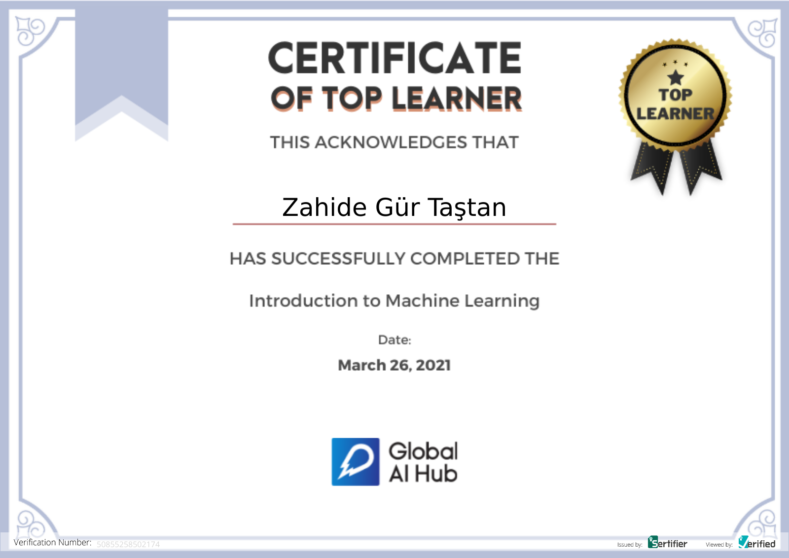

**Course Date:** 22.03.2021
**Name:** Zahide Gür 
**Surname:** Taştan  
**Email:** zahidett60@gmail.com  

## Project Name
Implementation of machine learning algorithms such that linear regression, decision tree, XGboost, Naive Bayes. 

## Requirements
```
Numpy
Pandas
Scikit-Learn
```
---

### Certification


